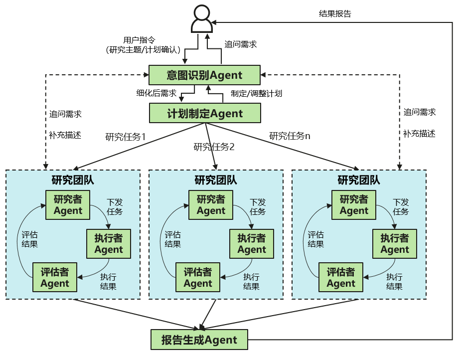

# DeepInsight

DeepInsight是面向企业的深度研究智能体，通过采用多Agent协同、上下文工程、MCP以及异构知识检索等技术，构建效果好、扩展易、体验优的关键能力，为在鲲鹏、昇腾以及其他智算平台上搭建开箱即用的深度研究能力提供开源范例与最佳实践。

您可以通过私有化部署进行体验，参见[快速开始](#2-快速开始)。

## 1. 软件架构

DeepInsight采用多Agent架构，通过多种不同角色Agent协作，提升复杂研究任务的完成能力：
- **意图识别Agent**：基于用户研究主题，向用户追问需求并细化
- **计划制定Agent**：基于细化后的需求，制定由多个研究任务组成的计划，并管理各任务状态，支持由用户自定义调整计划
- 每个任务交给一个**研究团队**进行研究，每个研究团队内部构成“**研究-执行-评估**”迭代式循环：
	- **研究者Agent**：对研究任务补充上下文（目标、验收标准、指导）后下发给执行者Agent，判断任务是否完成并给出下一步指导，过程中可追问用户补充所需信息
	- **执行者Agent**：按照给定的研究任务选择相应的工具完成每个研究任务
	- **评估者Agent**：对执行者Agent的执行结果进行评估反思，并检测知识冲突情况
- **报告生成Agent**：汇总各个研究任务结果，生成指定类型的多模态结构化报告



## 2. 快速开始

### 方式一：命令行运行
1. 安装依赖
```commandline
poetry install pyproject.toml
export DEEPSEEK_API_KEY=<YOUR-DEEPSEEK_API_KEY>
cp mcp_config.example.json mcp_config.json
```
2. 在`mcp_config.json`填写`TAVILY_API_KEY`
3. 运行
```commandline
python deepinsight/main.py "<YOUR-QUERY>" --output output
```

### 方式二：Web方式运行

#### 启动后端服务

```
poetry install pyproject.toml
python deepinsight/app.py
```

#### 启动前端服务
``` 
cd web
npm install
npm run dev
```

## 3. 使用说明

1. 打开浏览器窗口，点击深度研究按钮界面。选择数据来源，包括知识库、内网搜索、外网搜索等。
2. 输入研究主题，例如“MCP协议技术分析” ，智能体会为您生成初始计划供您确认，或点击“修改计划”按钮调整计划。
3. 点击“开始研究”确认计划，智能体自动制定研究计划、执行信息检索，整合为研究报告。

具体使用指导见[用户指南](./docs/user_guide.md)

## 4. 概念介绍与FAQ

关于本项目的更多设计理念、领域概念与常见问题，详见[概念介绍](./docs/conceptual_guide.md)与[FAQ](./docs/FAQ.md)

## 5. 参与贡献

1.  Fork本仓库并新建个人分支
2.  在分支上提交代码
3.  新建Pull Request，等待代码评审通过后即可合入仓库

