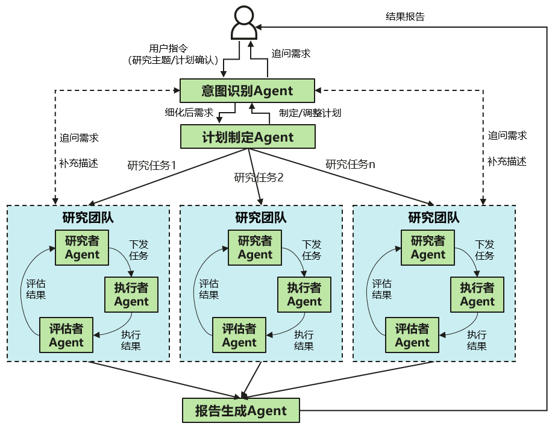

# DeepInsight

DeepInsight是面向企业的深度研究智能体，通过采用多Agent协同、上下文工程、MCP以及异构知识检索等技术，构建效果好、扩展易、体验优的关键能力，为在鲲鹏、昇腾以及其他智算平台上搭建开箱即用的深度研究能力提供开源范例与最佳实践。

您可以通过私有化部署进行体验，参见[快速开始](#2-快速开始)。

## 1. 软件架构

DeepInsight采用多Agent架构，通过多种不同角色Agent协作，提升复杂研究任务的完成能力：
- **意图识别Agent**：基于用户研究主题，向用户追问需求并细化
- **计划制定Agent**：基于细化后的需求，制定由多个研究任务组成的计划，并管理各任务状态，支持由用户自定义调整计划
- 每个任务交给一个**研究团队**进行研究，每个研究团队内部构成“**研究-执行-评估**”迭代式循环：
	- **研究者Agent**：对研究任务补充上下文（目标、验收标准、指导）后下发给执行者Agent，判断任务是否完成并给出下一步指导，过程中可追问用户补充所需信息
	- **执行者Agent**：按照给定的研究任务选择相应的工具完成每个研究任务
	- **评估者Agent**：对执行者Agent的执行结果进行评估反思，并检测知识冲突情况
- **报告生成Agent**：汇总各个研究任务结果，生成指定类型的多模态结构化报告



## 2. 快速开始

### 方式一：命令行运行
1. 安装依赖
```commandline
poetry install
cp .env.example .env
# 在 .env 中填写数据库与服务配置，并添加所需 API Key（例如：DEEPSEEK_API_KEY）
cp mcp_config.example.json mcp_config.json
# 在 mcp_config.json 中填写 TAVILY_API_KEY
```

2. 迁移数据库到最新版本
```commandline
poetry run alembic upgrade head
```
3. 命令行使用
- 查看帮助：`deepinsight --help` 或 `python -m deepinsight.cli.main --help`

- 会议管理（conference）
  - 列表：`deepinsight conference list`
  - 删除：`deepinsight conference remove --id 12`
  - 顶会洞察：`deepinsight conference generate --name "ICLR 2025" --files-src ./path/to/files`
  - 会议问答：`deepinsight conference qa --name "ICLR 2025" --files-src ./path/to/files --question "今年最佳论文有哪些创新点？"`
  
- 深度研究助手（research）
  - 启动研究：`deepinsight research start --topic "人工智能发展趋势"`
  - 查看帮助：`deepinsight research --help`

- 后端服务（api）
  - 启动后端服务：`deepinsight api start --config ./config.yaml`
  - 指定专家配置（可选）：`deepinsight api start --config ./config.yaml --expert-config ./experts.yaml`
  - 也可通过环境变量指定：`DEEPINSIGHT_CONFIG=./config.yaml deepinsight api start`

提示：可通过环境变量 `DEEPINSIGHT_CONFIG` 指定配置文件路径（默认 `./config.yaml`）。

### 图表图片路径配置（image_path_mode & image_base_url）
- 在 `config.yaml` 的 `workspace` 段控制图表图片 URL 的返回策略：
  - `image_path_mode`: `relative` 或 `base_url`
  - `image_base_url`: 当使用 `base_url` 模式时用于拼接的基础 URL（例如 `http://127.0.0.1:8888/api/v1/deepinsight/charts/image`）。
- 推荐设置：
  - 命令行/离线生成 PDF 与 Markdown：`image_path_mode: relative`
  - API/Web 预览：`image_path_mode: base_url` 并设置 `image_base_url` 指向你的服务地址。
- 返回示例：
  - `relative` → `../../charts/<uuid>.png`
  - `base_url` → `http://<ip>:<port>/api/v1/deepinsight/charts/image/<uuid>`
- 配置示例：
  ```yaml
  workspace:
    work_root: ./data
    chart_image_dir: charts
    image_path_mode: base_url
    image_base_url: http://127.0.0.1:8888/api/v1/deepinsight/charts/image
  ```
  若在命令行模式，请将 `image_path_mode` 设为 `relative`，其余保持默认即可。

### 方式二：Web方式运行

#### 启动后端服务

```
poetry install
deepinsight api start --config ./config.yaml
# 或直接运行脚本：
python deepinsight/api/app.py --config ./config.yaml
```

#### 启动前端服务
``` 
cd web
npm install
npm run dev
```

## 3. 使用说明

1. 打开浏览器窗口，点击深度研究按钮界面。选择数据来源，包括知识库、内网搜索、外网搜索等。
2. 输入研究主题，例如“MCP协议技术分析” ，智能体会为您生成初始计划供您确认，或点击“修改计划”按钮调整计划。
3. 点击“开始研究”确认计划，智能体自动制定研究计划、执行信息检索，整合为研究报告。

具体使用指导见[用户指南](./docs/user_guide.md)

### macOS PDF 生成提示（WeasyPrint 依赖）
- 在 macOS 上通过命令行将 Markdown 导出为 PDF 时，WeasyPrint 需要系统动态库支持。
- 请设置如下环境变量（建议写入 `~/.zshrc` 或 `~/.bashrc`）：

```bash
export DYLD_FALLBACK_LIBRARY_PATH=/opt/homebrew/lib:$DYLD_FALLBACK_LIBRARY_PATH
```

- 设定后重新打开终端或执行 `source ~/.zshrc` 使配置生效。
- 如仍有问题，请安装 WeasyPrint 所需库（示例：`brew install cairo pango gdk-pixbuf libffi`）以及中文字体（示例：`brew tap homebrew/cask-fonts && brew install --cask font-noto-sans-cjk`）。

## 4. 概念介绍与FAQ

关于本项目的更多设计理念、领域概念与常见问题，详见[概念介绍](./docs/conceptual_guide.md)与[FAQ](./docs/FAQ.md)

## 5. 参与贡献

1.  Fork本仓库并新建个人分支
2.  在分支上提交代码
3.  新建Pull Request，等待代码评审通过后即可合入仓库

