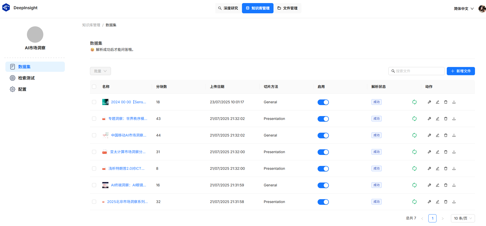
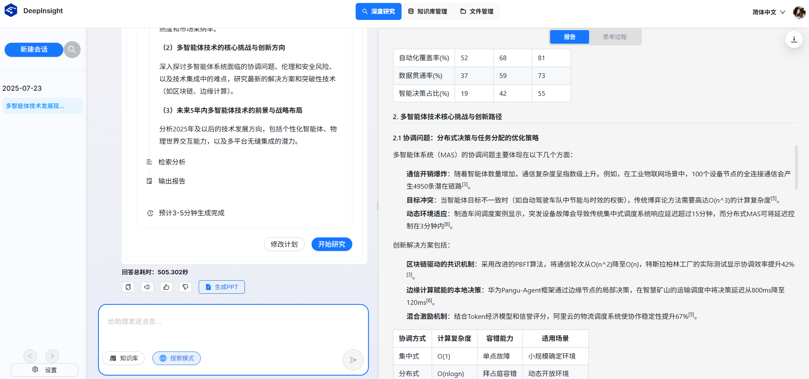

# DeepInsight

## 介绍

DeepInsight是面向企业的深度研究智能体，通过采用多Agent协同、上下文工程、MCP以及异构知识检索等技术，构建效果好、扩展易、体验优的关键能力，为在鲲鹏、昇腾以及其他智算平台上搭建开箱即用的深度研究能力提供开源范例与最佳实践。

## 软件架构

DeepInsight采用多Agent架构，通过多种不同角色Agent协作，提升复杂研究任务的完成能力：
- **用户交互Agent**：基于用户研究主题，向用户追问澄清需求，并与用户交互调整计划
- **计划制定Agent**：基于澄清后的需求，制定由多个研究任务组成的计划，并管理各任务研究状态
- 每个任务交给一个**研究团队**进行研究，每个研究团队由管理Agent、执行Agent、评估Agent组成：
	- **管理Agent**：对研究任务补充上下文（目标、验收标准、相关指导）后向执行Agent下发，对研究任务执行结果提供反馈，给出修正建议或进一步指导，并判断任务是否完成，过程中如需用户补充需求描述，可向用户追问
	- **执行Agent**：按照研究Agent给定的任务目标和描述，选择相应的工具（如网络搜索、知识库检索、代码执行等）完成每个研究任务
	- **评估Agent**：对执行Agent完成结果进行评估（例如对于信息检索类任务进行检索内容的评估和冲突检测）
- **报告生成Agent**：汇总各个研究任务结果，生成指定类型（Markdown/PPT/PDF/播客/视频）的多模态结果


## 快速上手

### 方式一：命令行运行
1. 安装依赖
```commandline
poetry install pyptoject.toml
export DEEPSEEK_API_KEY=<YOUR-DEEPSEEK_API_KEY>
cp mcp_config.example.json mcp_config.json
```
2. 在`mcp_config.json`填写`TAVILY_API_KEY`
3. 运行
```commandline
python deepinsight/app.py "<YOUR-QUERY>" --output output
```

### 方式二：Web方式运行

#### 启动后端服务

```
poetry install pyptoject.toml
python deepinsight/app.py
```

#### 启动前端服务
``` 
cd web
npm install
npm run dev
```

## 使用说明

DeepInsight提供基于多种数据源（私域知识库、网络搜索、……）的深度研究能力，你可以选择其中之一或多种数据源的组合来让智能体完成研究任务。

### 1、安装部署：

- 配置环境变量（网络搜索工具Tavily Key）： `export TAVILY_API_KEY=XXX`
- 启动依赖的MCP Server（当前为网络搜索工具）：`sh ./scripts/start_mcp_server.sh`
- 启动docker容器：`docker-compose -f docker-compose.yaml up`

### 2、建知识库（可选）：

在“知识库管理”页面上点击“新建知识库”按钮新建知识库，按默认配置保存后，在知识库界面上传文档（目前支持txt、markdown、doc、docx、ppt、pptx、pdf类型文档），系统自动解析文档。系统支持一次上传多份文档并进行批量解析。


### 3、使用“深度研究”：

在“深度研究”界面上选择数据源，可选项包括”知识库“或网络搜索，在“搜索模式”中指定网络搜索的来源为”外网“或”内网“。

在对话框中输入研究主题，例如“多智能体技术发展现状与展望”，系统开始分析，给出初始研究计划，你可以点击“修改计划”对计划进行调整，若无需调整，直接点击“开始研究”按钮，系统开始研究过程，并自动展示思考过程。


研究时长视任务复杂度而定，一般约5分钟左右后输出一份结构化的研究报告，报告内容中附有各项引用来源。



你可以导出研究报告，也可以继续与智能体进行对话，开始新的研究任务。

## 参与贡献

1.  Fork 本仓库并新建个人分支
2.  在分支上提交代码
3.  新建 Pull Request，等待代码评审通过后即可合入仓库

