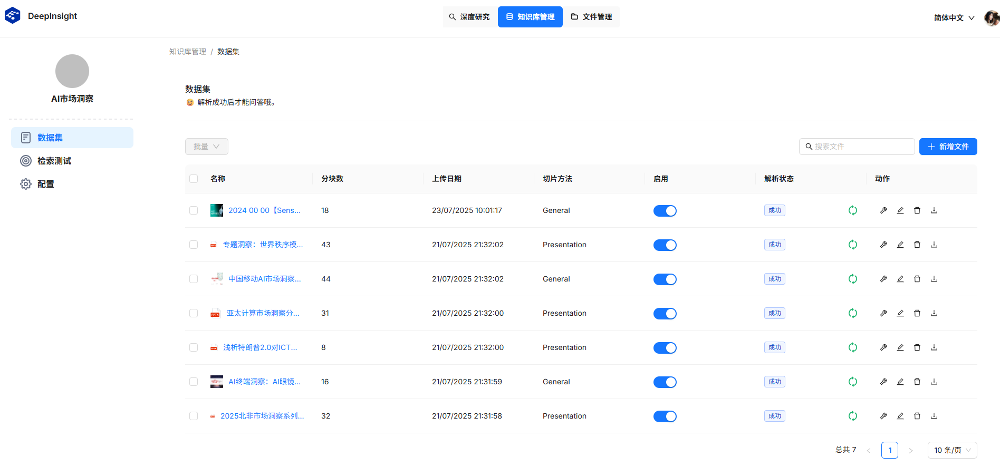
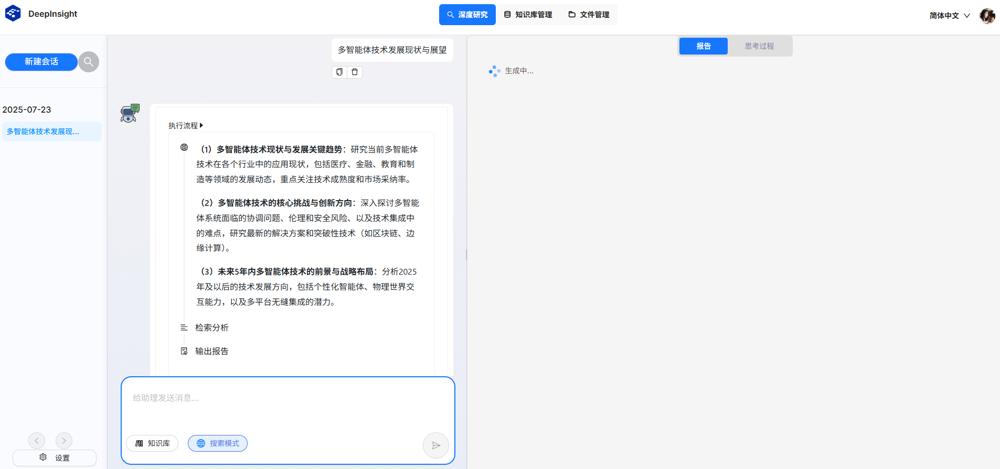
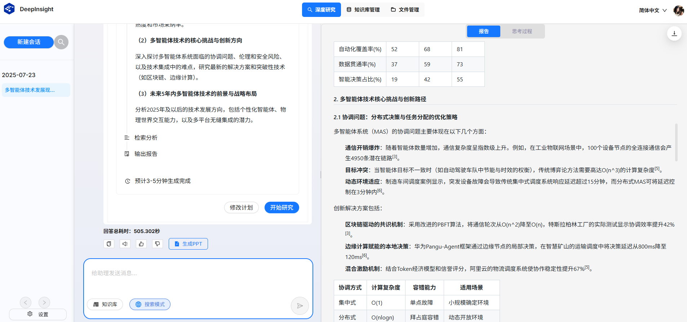

# 用户指南

DeepInsight提供基于多种数据源（私域知识库、网络搜索、……）的深度研究能力，你可以选择其中之一或多种数据源的组合来让智能体完成研究任务。

### 1、安装部署：

- 配置环境变量（网络搜索工具Tavily Key）： `export TAVILY_API_KEY=XXX`
- 启动依赖的MCP Server（当前为网络搜索工具）：`sh ./scripts/start_mcp_server.sh`
- 启动docker容器：`docker-compose -f docker-compose.yaml up`

### 2、建知识库（可选）：

在“知识库管理”页面上点击“新建知识库”按钮新建知识库，按默认配置保存后，在知识库界面上传文档（目前支持txt、markdown、doc、docx、ppt、pptx、pdf类型文档），系统自动解析文档。系统支持一次上传多份文档并进行批量解析。

### 3、使用“深度研究”：

在“深度研究”界面上选择数据源，可选项包括”知识库“或网络搜索，在“搜索模式”中指定网络搜索的来源为”外网“或”内网“。

在对话框中输入研究主题，例如“多智能体技术发展现状与展望”，系统开始分析，给出初始研究计划，你可以点击“修改计划”对计划进行调整，若无需调整，直接点击“开始研究”按钮，系统开始研究过程，并自动展示思考过程。

研究时长视任务复杂度而定，一般约5分钟左右后输出一份结构化的研究报告，报告内容中附有各项引用来源。

你可以导出研究报告，也可以继续与智能体进行对话，开始新的研究任务。
